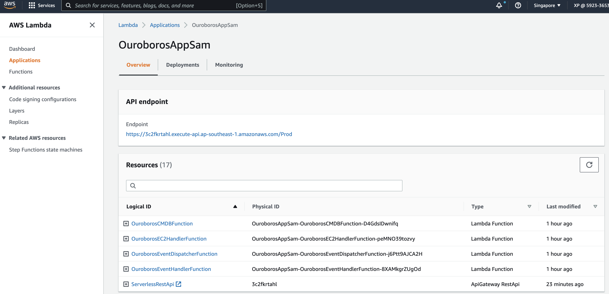
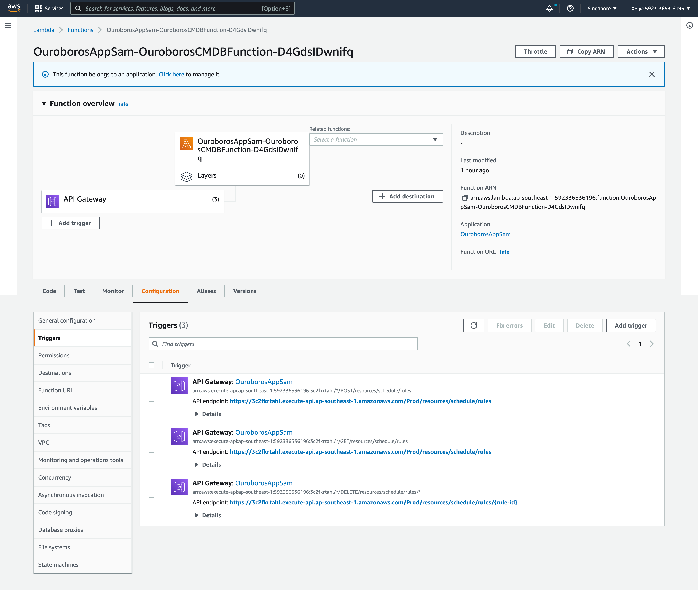
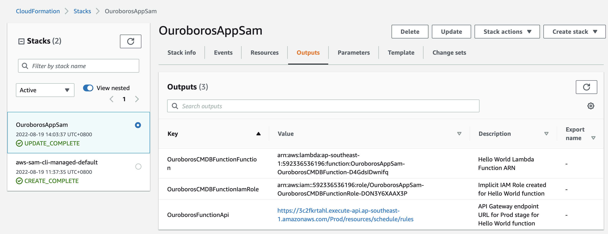
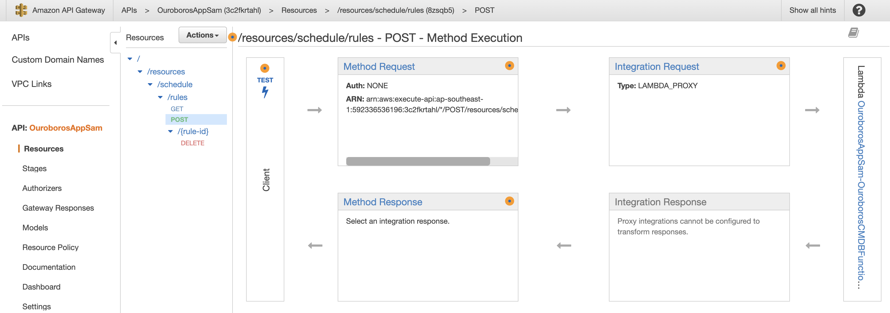
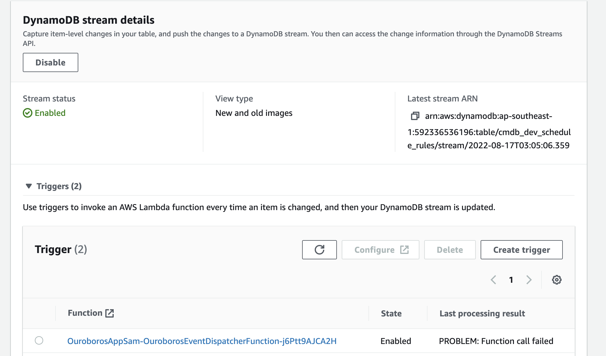
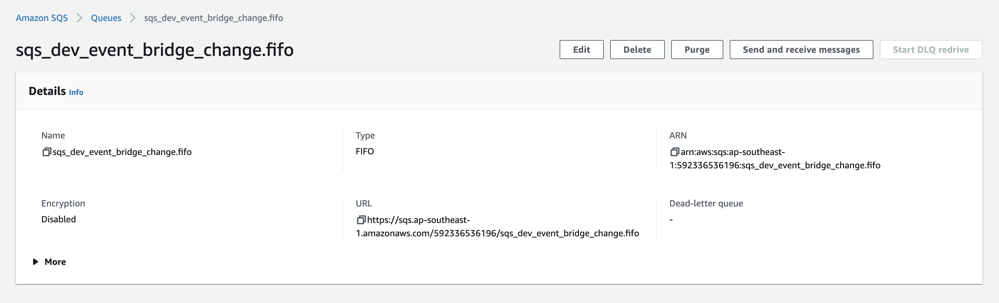

# How to Deploy with AWS SAM / 如何使用AWS SAM部署

Ouroboros backend serverless app follows AWS SAM architecture.  
Learn more on the original [README](README-AWS.md)

Ouroboros后端无服务架构基于AWS SAM架构实现和部署。
关于AWS SAM请参阅AWS [README](README-AWS.md)

# Create or Get Dependency Service Resource / 创建或获取依赖资源

## DynamoDB Table
Ouroboros uses default table name is `cmdb_dev_schedule_rules`  
Ouroboros使用的默认Table名称为 `cmdb_dev_schedule_rules`  

获取DynamoDB Streams ARN:  
Get DynamoDB Streams ARN:  

Example 示例:  
>arn:aws:dynamodb:ap-southeast-1:592336536196:table/cmdb_dev_schedule_rules/stream/2022-08-17T03:05:06.359

## SQS
Ouroboros uses two default SQS queue with type:  
Ouroboros 使用两个SQS队列，默认名称和类型为:  
 - sqs_dev_ec2_state_change - Standard  
 - sqs_dev_event_bridge_change.fifo - FIFO

获取SQS Queue ARN:   
Get SQS Queue ARN:  
> arn:aws:sqs:ap-southeast-1:592336536196:sqs_dev_event_bridge_change.fifo  

# Configure SAM Template / 配置SAM模板

Replace DynamoDB & SQS arn in `template.yaml`

```yaml
...
Events:
ouroborosDDBEvent:
  Type: DynamoDB
  Properties:
    Stream: !Replace your own DDB Stream ARN here
    StartingPosition: LATEST
    BatchSize: 1
...
```

```yaml
...
Events:
OuroborosFunctionSQSQueue:
  Type: SQS
  Properties:
    Queue: !Replace your own SQS Queue ARN here
...
```

# Build / 构建

Ensure you have configured AWS credential/config in your environment.  
请确保AWS SAM和cli工具已经正常安装和配置

* Run / 运行

```shell
sam build
```

* Example / 示例

```shell
sam build
Building codeuri: /Users/xp/workspace-docker/ouroboros_ims_service_sam/ouroboros_ims_dynamodb_sam runtime: python3.9 metadata: {} architecture: x86_64 functions: ['OuroborosCMDBFunction']
Running PythonPipBuilder:ResolveDependencies
Running PythonPipBuilder:CopySource
Building codeuri: /Users/xp/workspace-docker/ouroboros_ims_service_sam/ouroboros_ims_event_dispatcher_sam runtime: python3.9 metadata: {} architecture: x86_64 functions: ['OuroborosEventDispatcherFunction']
Running PythonPipBuilder:ResolveDependencies
Running PythonPipBuilder:CopySource
Building codeuri: /Users/xp/workspace-docker/ouroboros_ims_service_sam/ouroboros_ims_service_eventbridge_sam runtime: python3.9 metadata: {} architecture: x86_64 functions: ['OuroborosEventHandlerFunction']
Running PythonPipBuilder:ResolveDependencies
Running PythonPipBuilder:CopySource
Building codeuri: /Users/xp/workspace-docker/ouroboros_ims_service_sam/ouroboros_ims_service_ec2_sam runtime: python3.9 metadata: {} architecture: x86_64 functions: ['OuroborosEC2HandlerFunction']
Running PythonPipBuilder:ResolveDependencies
Running PythonPipBuilder:CopySource

Build Succeeded

Built Artifacts  : .aws-sam/build
Built Template   : .aws-sam/build/template.yaml

Commands you can use next
=========================
[*] Invoke Function: sam local invoke
[*] Test Function in the Cloud: sam sync --stack-name {stack-name} --watch
[*] Deploy: sam deploy --guided
```

# Test / 测试

Skipped and not shown this stage which we have covered internally.  
不在本次目标之内，但我们已经在内部实施了单元测试和集成测试。请参阅AWS [README](README-AWS.md)

# Deploy / 部署

An initial deployment is suggested use `--guided`  
首次部署强烈建议使用`--guided`参数  

* Run / 运行

```shell
sam deploy --guided
```

* Example / 实例

```shell
sam deploy --guided

Configuring SAM deploy
======================

	Looking for config file [samconfig.toml] :  Found
	Reading default arguments  :  Success

	Setting default arguments for 'sam deploy'
	=========================================
	Stack Name [OuroborosAppSam]:
	AWS Region [ap-southeast-1]:
	Parameter Environment [dev]:
	#Shows you resources changes to be deployed and require a 'Y' to initiate deploy
	Confirm changes before deploy [Y/n]:
	#SAM needs permission to be able to create roles to connect to the resources in your template
	Allow SAM CLI IAM role creation [Y/n]:
	#Preserves the state of previously provisioned resources when an operation fails
	Disable rollback [Y/n]: N
	OuroborosCMDBFunction may not have authorization defined, Is this okay? [y/N]: y
	OuroborosCMDBFunction may not have authorization defined, Is this okay? [y/N]: y
	OuroborosCMDBFunction may not have authorization defined, Is this okay? [y/N]: y
	Save arguments to configuration file [Y/n]:
	SAM configuration file [samconfig.toml]:
	SAM configuration environment [default]:

	Looking for resources needed for deployment:
	 Managed S3 bucket: aws-sam-cli-managed-default-samclisourcebucket-ze4ea4ny4jlm
	 A different default S3 bucket can be set in samconfig.toml

	Saved arguments to config file
	Running 'sam deploy' for future deployments will use the parameters saved above.
	The above parameters can be changed by modifying samconfig.toml
	Learn more about samconfig.toml syntax at
	https://docs.aws.amazon.com/serverless-application-model/latest/developerguide/serverless-sam-cli-config.html

File with same data already exists at OuroborosAppSam/79a44a842d582122e4f098d3b2a15af9, skipping upload
File with same data already exists at OuroborosAppSam/8eb91e38b0e10a49a17dbff30ab971bd, skipping upload
File with same data already exists at OuroborosAppSam/fb6c4854a4d380586d52423fb56b4e86, skipping upload
File with same data already exists at OuroborosAppSam/a6e2013103d961be5114cf1f433a6466, skipping upload

	Deploying with following values
	===============================
	Stack name                   : OuroborosAppSam
	Region                       : ap-southeast-1
	Confirm changeset            : True
	Disable rollback             : False
	Deployment s3 bucket         : aws-sam-cli-managed-default-samclisourcebucket-ze4ea4ny4jlm
	Capabilities                 : ["CAPABILITY_IAM"]
	Parameter overrides          : {"Environment": "dev"}
	Signing Profiles             : {}

Initiating deployment
=====================
Uploading to OuroborosAppSam/4c188ef728ed8434b3912d982f2ad05d.template  3421 / 3421  (100.00%)

Waiting for changeset to be created..

CloudFormation stack changeset
-------------------------------------------------------------------------------------------------------------------------------------------------------------------------------------------------------------
Operation                                           LogicalResourceId                                   ResourceType                                        Replacement
-------------------------------------------------------------------------------------------------------------------------------------------------------------------------------------------------------------
+ Add                                               OuroborosCMDBFunctionOuroborosFunctionAPIDELETEPe   AWS::Lambda::Permission                             N/A
                                                    rmissionProd
+ Add                                               OuroborosCMDBFunctionOuroborosFunctionAPIGETPermi   AWS::Lambda::Permission                             N/A
                                                    ssionProd
+ Add                                               OuroborosCMDBFunctionOuroborosFunctionAPIPOSTPerm   AWS::Lambda::Permission                             N/A
                                                    issionProd
+ Add                                               OuroborosCMDBFunctionRole                           AWS::IAM::Role                                      N/A
+ Add                                               OuroborosCMDBFunction                               AWS::Lambda::Function                               N/A
+ Add                                               OuroborosEC2HandlerFunctionOuroborosFunctionSQSQu   AWS::Lambda::EventSourceMapping                     N/A
                                                    eue
+ Add                                               OuroborosEC2HandlerFunctionRole                     AWS::IAM::Role                                      N/A
+ Add                                               OuroborosEC2HandlerFunction                         AWS::Lambda::Function                               N/A
+ Add                                               OuroborosEventDispatcherFunctionRole                AWS::IAM::Role                                      N/A
+ Add                                               OuroborosEventDispatcherFunctionouroborosDDBEvent   AWS::Lambda::EventSourceMapping                     N/A
+ Add                                               OuroborosEventDispatcherFunction                    AWS::Lambda::Function                               N/A
+ Add                                               OuroborosEventHandlerFunctionOuroborosFunctionSQS   AWS::Lambda::EventSourceMapping                     N/A
                                                    Queue
+ Add                                               OuroborosEventHandlerFunctionRole                   AWS::IAM::Role                                      N/A
+ Add                                               OuroborosEventHandlerFunction                       AWS::Lambda::Function                               N/A
+ Add                                               ServerlessRestApiDeployment681d160eb8               AWS::ApiGateway::Deployment                         N/A
+ Add                                               ServerlessRestApiProdStage                          AWS::ApiGateway::Stage                              N/A
+ Add                                               ServerlessRestApi                                   AWS::ApiGateway::RestApi                            N/A
-------------------------------------------------------------------------------------------------------------------------------------------------------------------------------------------------------------

Changeset created successfully. arn:aws:cloudformation:ap-southeast-1:592336536196:changeSet/samcli-deploy1660889016/7f9187fb-5b53-4014-8400-7efa7979339f


Previewing CloudFormation changeset before deployment
======================================================
Deploy this changeset? [y/N]: y

2022-08-19 14:03:58 - Waiting for stack create/update to complete

CloudFormation events from stack operations
-------------------------------------------------------------------------------------------------------------------------------------------------------------------------------------------------------------
ResourceStatus                                      ResourceType                                        LogicalResourceId                                   ResourceStatusReason
-------------------------------------------------------------------------------------------------------------------------------------------------------------------------------------------------------------
CREATE_IN_PROGRESS                                  AWS::IAM::Role                                      OuroborosEventDispatcherFunctionRole                -
CREATE_IN_PROGRESS                                  AWS::IAM::Role                                      OuroborosEventHandlerFunctionRole                   -
CREATE_IN_PROGRESS                                  AWS::IAM::Role                                      OuroborosCMDBFunctionRole                           -
CREATE_IN_PROGRESS                                  AWS::IAM::Role                                      OuroborosEventDispatcherFunctionRole                Resource creation Initiated
CREATE_IN_PROGRESS                                  AWS::IAM::Role                                      OuroborosEventHandlerFunctionRole                   Resource creation Initiated
CREATE_IN_PROGRESS                                  AWS::IAM::Role                                      OuroborosEC2HandlerFunctionRole                     -
CREATE_IN_PROGRESS                                  AWS::IAM::Role                                      OuroborosEC2HandlerFunctionRole                     Resource creation Initiated
CREATE_IN_PROGRESS                                  AWS::IAM::Role                                      OuroborosCMDBFunctionRole                           Resource creation Initiated
CREATE_COMPLETE                                     AWS::IAM::Role                                      OuroborosEventHandlerFunctionRole                   -
CREATE_COMPLETE                                     AWS::IAM::Role                                      OuroborosEventDispatcherFunctionRole                -
CREATE_COMPLETE                                     AWS::IAM::Role                                      OuroborosCMDBFunctionRole                           -
CREATE_IN_PROGRESS                                  AWS::Lambda::Function                               OuroborosCMDBFunction                               -
CREATE_IN_PROGRESS                                  AWS::Lambda::Function                               OuroborosEventHandlerFunction                       -
CREATE_COMPLETE                                     AWS::IAM::Role                                      OuroborosEC2HandlerFunctionRole                     -
CREATE_IN_PROGRESS                                  AWS::Lambda::Function                               OuroborosEventDispatcherFunction                    -
CREATE_IN_PROGRESS                                  AWS::Lambda::Function                               OuroborosEventHandlerFunction                       Resource creation Initiated
CREATE_IN_PROGRESS                                  AWS::Lambda::Function                               OuroborosCMDBFunction                               Resource creation Initiated
CREATE_IN_PROGRESS                                  AWS::Lambda::Function                               OuroborosEC2HandlerFunction                         -
CREATE_IN_PROGRESS                                  AWS::Lambda::Function                               OuroborosEventDispatcherFunction                    Resource creation Initiated
CREATE_IN_PROGRESS                                  AWS::Lambda::Function                               OuroborosEC2HandlerFunction                         Resource creation Initiated
CREATE_COMPLETE                                     AWS::Lambda::Function                               OuroborosEventHandlerFunction                       -
CREATE_IN_PROGRESS                                  AWS::Lambda::EventSourceMapping                     OuroborosEventHandlerFunctionOuroborosFunctionSQS   -
                                                                                                        Queue
CREATE_COMPLETE                                     AWS::Lambda::Function                               OuroborosCMDBFunction                               -
CREATE_COMPLETE                                     AWS::Lambda::Function                               OuroborosEventDispatcherFunction                    -
CREATE_IN_PROGRESS                                  AWS::Lambda::EventSourceMapping                     OuroborosEventHandlerFunctionOuroborosFunctionSQS   Resource creation Initiated
                                                                                                        Queue
CREATE_IN_PROGRESS                                  AWS::Lambda::EventSourceMapping                     OuroborosEventDispatcherFunctionouroborosDDBEvent   -
CREATE_IN_PROGRESS                                  AWS::ApiGateway::RestApi                            ServerlessRestApi                                   -
CREATE_COMPLETE                                     AWS::Lambda::Function                               OuroborosEC2HandlerFunction                         -
CREATE_IN_PROGRESS                                  AWS::Lambda::EventSourceMapping                     OuroborosEC2HandlerFunctionOuroborosFunctionSQSQu   -
                                                                                                        eue
CREATE_COMPLETE                                     AWS::ApiGateway::RestApi                            ServerlessRestApi                                   -
CREATE_IN_PROGRESS                                  AWS::Lambda::EventSourceMapping                     OuroborosEventDispatcherFunctionouroborosDDBEvent   Resource creation Initiated
CREATE_IN_PROGRESS                                  AWS::ApiGateway::RestApi                            ServerlessRestApi                                   Resource creation Initiated
CREATE_IN_PROGRESS                                  AWS::Lambda::Permission                             OuroborosCMDBFunctionOuroborosFunctionAPIDELETEPe   -
                                                                                                        rmissionProd
CREATE_IN_PROGRESS                                  AWS::Lambda::Permission                             OuroborosCMDBFunctionOuroborosFunctionAPIGETPermi   -
                                                                                                        ssionProd
CREATE_IN_PROGRESS                                  AWS::Lambda::Permission                             OuroborosCMDBFunctionOuroborosFunctionAPIPOSTPerm   -
                                                                                                        issionProd
CREATE_IN_PROGRESS                                  AWS::ApiGateway::Deployment                         ServerlessRestApiDeployment681d160eb8               -
CREATE_IN_PROGRESS                                  AWS::Lambda::EventSourceMapping                     OuroborosEC2HandlerFunctionOuroborosFunctionSQSQu   Resource creation Initiated
                                                                                                        eue
CREATE_COMPLETE                                     AWS::Lambda::EventSourceMapping                     OuroborosEventDispatcherFunctionouroborosDDBEvent   -
CREATE_IN_PROGRESS                                  AWS::Lambda::Permission                             OuroborosCMDBFunctionOuroborosFunctionAPIDELETEPe   Resource creation Initiated
                                                                                                        rmissionProd
CREATE_IN_PROGRESS                                  AWS::Lambda::Permission                             OuroborosCMDBFunctionOuroborosFunctionAPIGETPermi   Resource creation Initiated
                                                                                                        ssionProd
CREATE_IN_PROGRESS                                  AWS::Lambda::Permission                             OuroborosCMDBFunctionOuroborosFunctionAPIPOSTPerm   Resource creation Initiated
                                                                                                        issionProd
CREATE_IN_PROGRESS                                  AWS::ApiGateway::Deployment                         ServerlessRestApiDeployment681d160eb8               Resource creation Initiated
CREATE_COMPLETE                                     AWS::ApiGateway::Deployment                         ServerlessRestApiDeployment681d160eb8               -
CREATE_IN_PROGRESS                                  AWS::ApiGateway::Stage                              ServerlessRestApiProdStage                          -
CREATE_COMPLETE                                     AWS::ApiGateway::Stage                              ServerlessRestApiProdStage                          -
CREATE_IN_PROGRESS                                  AWS::ApiGateway::Stage                              ServerlessRestApiProdStage                          Resource creation Initiated
CREATE_COMPLETE                                     AWS::Lambda::Permission                             OuroborosCMDBFunctionOuroborosFunctionAPIDELETEPe   -
                                                                                                        rmissionProd
CREATE_COMPLETE                                     AWS::Lambda::Permission                             OuroborosCMDBFunctionOuroborosFunctionAPIGETPermi   -
                                                                                                        ssionProd
CREATE_COMPLETE                                     AWS::Lambda::Permission                             OuroborosCMDBFunctionOuroborosFunctionAPIPOSTPerm   -
                                                                                                        issionProd
CREATE_COMPLETE                                     AWS::Lambda::EventSourceMapping                     OuroborosEC2HandlerFunctionOuroborosFunctionSQSQu   -
                                                                                                        eue
CREATE_COMPLETE                                     AWS::Lambda::EventSourceMapping                     OuroborosEventHandlerFunctionOuroborosFunctionSQS   -
                                                                                                        Queue
CREATE_COMPLETE                                     AWS::CloudFormation::Stack                          OuroborosAppSam                                     -
-------------------------------------------------------------------------------------------------------------------------------------------------------------------------------------------------------------

CloudFormation outputs from deployed stack
-------------------------------------------------------------------------------------------------------------------------------------------------------------------------------------------------------------
Outputs
-------------------------------------------------------------------------------------------------------------------------------------------------------------------------------------------------------------
Key                 OuroborosFunctionApi
Description         API Gateway endpoint URL for Prod stage for Hello World function
Value               https://3c2fkrtahl.execute-api.ap-southeast-1.amazonaws.com/dev/resources/schedule/rules

Key                 OuroborosCMDBFunctionIamRole
Description         Implicit IAM Role created for Hello World function
Value               arn:aws:iam::592336536196:role/OuroborosAppSam-OuroborosCMDBFunctionRole-DON3Y6XAAX3P

Key                 OuroborosCMDBFunctionFunction
Description         Hello World Lambda Function ARN
Value               arn:aws:lambda:ap-southeast-1:592336536196:function:OuroborosAppSam-OuroborosCMDBFunction-D4GdsIDwnifq
-------------------------------------------------------------------------------------------------------------------------------------------------------------------------------------------------------------

Successfully created/updated stack - OuroborosAppSam in ap-southeast-1
```

# AWS Console

* Lambda Application  



* Lambdas  

  

* CloudFormation  



* API Gateway  



* DynamoDB



* SQS

